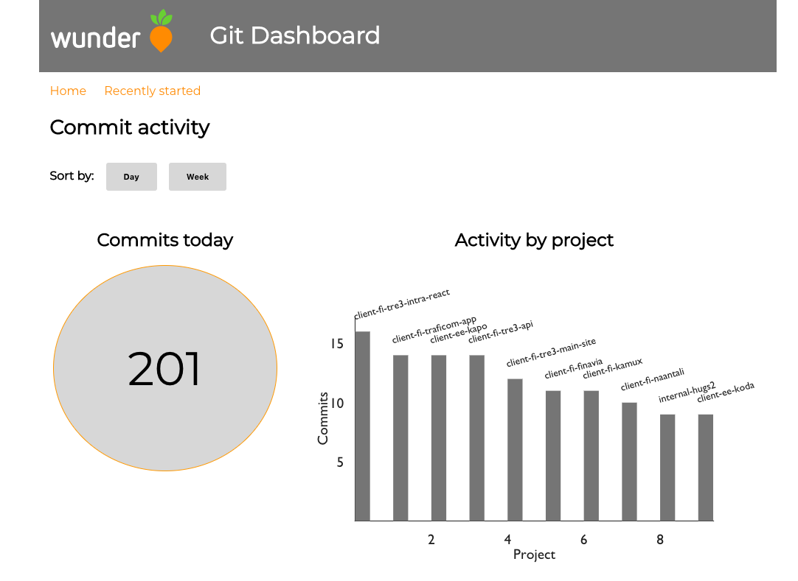

# Wunder Git Dashboard #

Source code for Jani Koski's Bachelor's thesis.

A full stack Javascript application which visualizes version control data coming from Elasticsearch

## Technology stack ##

### Server ###
- GraphQL (Apollo Server), which acts as a gateway between React and Elasticsearch

### Client ###
- React (setup is done with Create React app)
- Victory.js for data visualizing charts
- Apollo Client for querying the GraphQL API
- Styled components for general styling purposes

The connection to Elasticsearch API is done by Jani's Kibana username/pass via basic auth, which is defined in .env file.
So ff you want to run the app locally, create a .env file to the project's root and then ask Jani for the credentials.
After that it's just a matter of running both server and client:

#### Server: ####
  `yarn install` 
  `yarn run server` 
Starts at localhost:4000

#### Client: ####
  `cd client && yarn install` 
  `yarn start` 
Starts at localhost:3000

